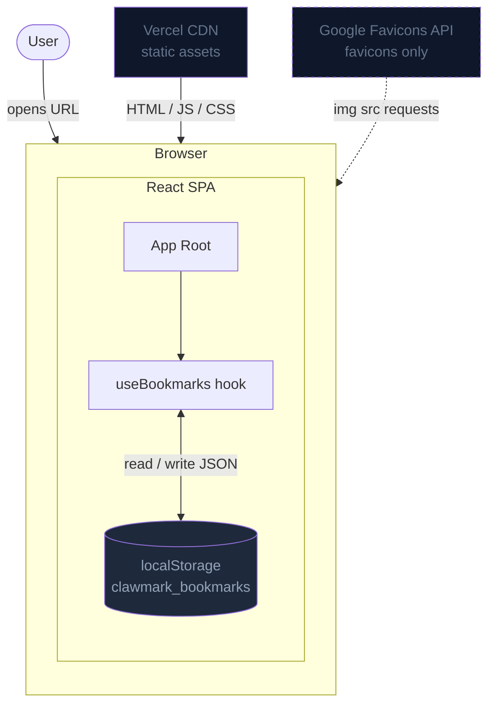

# P2 Architecture: ClawMark

> Version: 1.0
> Date: 2026-03-17
> Status: Draft
> Based on: P1-prd.md (v1.1)

---

## 1. Technology Stack

| Layer | Choice | Rationale |
|-------|--------|-----------|
| Framework | Next.js 15 (`output: 'export'`) | Static export produces pure HTML/JS/CSS — no server required. App Router for modern file-based routing. Familiar to the claw-platform team. |
| Styling | Tailwind CSS v4 | Utility-first, zero-runtime CSS. Built-in dark mode via `prefers-color-scheme` (no extra library). Small final bundle. |
| Component Library | shadcn/ui | Accessible, unstyled-by-default components (Dialog, Button, Input, Badge). Copied into source — no version lock. |
| ID Generation | nanoid | 21-character URL-safe IDs. 2KB, no dependencies. |
| Language | TypeScript | Type safety for data model and hook contract. Standard in the claw stack. |
| Storage | Browser `localStorage` | Single-origin, zero-setup persistence. ~5–10 MB capacity (~10–20K bookmarks). |
| Deployment | Vercel (static) | Free tier, zero config for static exports, CDN-distributed. |
| Package Manager | pnpm | Consistent with claw-platform workspace tooling. |

**What is intentionally excluded:**

- No API routes — `next.config` sets `output: 'export'`, making them impossible
- No server components — every component is a client component
- No database — localStorage is the only persistence layer
- No global state manager (Redux, Zustand, Jotai) — a single custom hook is sufficient
- No analytics or third-party scripts in MVP

---

## 2. System Architecture

The architecture is deliberately flat. There are three layers: the browser, the React SPA, and localStorage. No network calls happen after the initial static asset load (except favicon fetches to Google's API, which are image requests only).



**Data flow for every user action:**

1. User interacts with a component (add, edit, delete, search, filter)
2. Component calls a function from the `useBookmarks()` hook
3. Hook updates React state (triggers re-render) and writes serialized JSON to `localStorage`
4. Component re-renders with the new state — no round-trip, no latency

---

## 3. Project Structure

```
clawmark/
├── docs/
│   └── forge/
│       ├── P0-brainstorm-report.md
│       ├── P1-prd.md
│       ├── P2-architecture.md       ← this document
│       └── P2-dev-plan.md
│
└── app/                             ← Next.js project root
    ├── next.config.ts               ← output: 'export', images.unoptimized: true
    ├── vercel.json                  ← CSP headers, static config
    ├── package.json
    ├── tsconfig.json
    ├── tailwind.config.ts
    ├── components.json              ← shadcn/ui config
    │
    ├── app/                         ← Next.js App Router
    │   ├── layout.tsx               ← root layout, font, metadata
    │   ├── page.tsx                 ← single SPA page (client component)
    │   └── globals.css              ← Tailwind base + CSS variables
    │
    ├── components/
    │   ├── layout/
    │   │   ├── Header.tsx           ← app title, SearchBar, Add button
    │   │   └── TagSidebar.tsx       ← tag list with counts, active filter state
    │   │
    │   ├── bookmarks/
    │   │   ├── BookmarkList.tsx     ← maps over filtered bookmarks
    │   │   ├── BookmarkCard.tsx     ← single bookmark row/card
    │   │   └── EmptyState.tsx       ← zero-bookmark guidance UI
    │   │
    │   ├── dialogs/
    │   │   ├── AddBookmarkDialog.tsx
    │   │   ├── EditBookmarkDialog.tsx
    │   │   ├── DeleteConfirmDialog.tsx
    │   │   └── ImportDialog.tsx
    │   │
    │   └── ui/                      ← shadcn/ui primitives (generated)
    │       ├── button.tsx
    │       ├── dialog.tsx
    │       ├── input.tsx
    │       ├── badge.tsx
    │       └── ...
    │
    ├── hooks/
    │   └── useBookmarks.ts          ← core data hook (localStorage + React state)
    │
    ├── lib/
    │   ├── types.ts                 ← Bookmark interface, ImportResult, etc.
    │   ├── storage.ts               ← localStorage read/write helpers
    │   ├── bookmarkOps.ts           ← pure CRUD + search + dedup functions
    │   └── exportImport.ts          ← JSON export/import + validation
    │
    └── public/
        └── favicon.ico
```

**Key constraints enforced by this structure:**

- `app/page.tsx` is the only route — true SPA, single URL
- `lib/` contains only pure functions — no React imports, fully testable in isolation
- `hooks/` is the only place that touches `localStorage` — via `storage.ts`
- `components/ui/` is owned by shadcn/ui codegen — never edited manually

---

## 4. Data Model

### TypeScript Interfaces

```typescript
// lib/types.ts

export interface Bookmark {
  id: string;           // nanoid() — 21 chars, URL-safe
  url: string;          // required, validated as URL
  title: string;        // required, non-empty
  description?: string; // optional
  tags: string[];       // default [], lowercase-normalized
  createdAt: string;    // ISO 8601
  updatedAt: string;    // ISO 8601
  lastAccessedAt?: string; // reserved for P1 sort-by-access, unused in MVP
}

export interface BookmarkFormData {
  url: string;
  title: string;
  description: string;
  tags: string; // raw input string, e.g. "react, typescript, tutorial"
}

export interface ImportResult {
  imported: number;
  skipped: number;      // duplicates by URL (first-wins)
  errors: string[];     // parse/validation errors
}

export interface StorageQuota {
  used: number;         // bytes estimated
  total: number;        // bytes estimated
  percentUsed: number;
  isWarning: boolean;   // true when > 80%
  isFull: boolean;      // true when > 95%
}
```

### localStorage Layout

```
Key:   "clawmark_bookmarks"
Value: JSON.stringify(Bookmark[])
```

Single key, single JSON array. No versioning schema in MVP — the structure is simple enough that migration is not needed. If breaking changes are introduced in v2, a migration function in `storage.ts` can detect the old shape and transform it on first read.

### Pure Helper Functions (lib/bookmarkOps.ts)

```typescript
// All functions are pure — they receive state and return new state (never mutate)

createBookmark(data: BookmarkFormData): Bookmark
updateBookmark(bookmarks: Bookmark[], id: string, data: BookmarkFormData): Bookmark[]
deleteBookmark(bookmarks: Bookmark[], id: string): Bookmark[]
findByUrl(bookmarks: Bookmark[], url: string): Bookmark | undefined

searchBookmarks(bookmarks: Bookmark[], query: string, activeTag: string | null): Bookmark[]
// Searches: title, url, description, tags (case-insensitive)
// Combines text query AND tag filter with AND logic

normalizeTags(raw: string): string[]
// "React, TypeScript , tutorial" → ["react", "typescript", "tutorial"]

getAllTags(bookmarks: Bookmark[]): Map<string, number>
// Returns tag → count map, sorted by count descending
```

### Export/Import Helpers (lib/exportImport.ts)

```typescript
exportToJson(bookmarks: Bookmark[]): void
// Triggers browser download of "clawmark-export-YYYY-MM-DD.json"

parseImportFile(file: File): Promise<Bookmark[]>
// Validates JSON structure, throws on invalid format

mergeBookmarks(existing: Bookmark[], incoming: Bookmark[]): ImportResult & { merged: Bookmark[] }
// Deduplicates by URL (first-wins), returns merged array + stats
```

---

## 5. Component Architecture

### Component Tree

```
app/page.tsx (client component — root of the SPA)
├── useBookmarks()                    ← data hook, passed down as props
│
├── Header
│   ├── app title / logo
│   ├── SearchBar                     ← debounced input, calls setQuery
│   ├── ImportDialog (trigger)        ← file input → mergeBookmarks
│   ├── export button                 ← calls exportToJson directly
│   └── AddBookmarkDialog (trigger)   ← Cmd/Ctrl+K also opens this
│
├── TagSidebar (desktop) / TagStrip (mobile)
│   └── tag buttons                   ← click sets activeTag filter
│
└── main content
    ├── BookmarkList
    │   ├── BookmarkCard (×N)
    │   │   ├── favicon img
    │   │   ├── title + url
    │   │   ├── description (truncated)
    │   │   ├── tag badges
    │   │   ├── edit button → EditBookmarkDialog
    │   │   └── delete button → DeleteConfirmDialog
    │   └── EmptyState (when list is empty)
    │
    ├── EditBookmarkDialog (modal)
    ├── DeleteConfirmDialog (modal)
    └── AddBookmarkDialog (modal)
```

### Component Responsibilities

| Component | Owns | Does NOT own |
|-----------|------|-------------|
| `app/page.tsx` | Keyboard shortcut listener, dialog open state | Bookmark data logic |
| `Header` | Layout of top bar | Search state (passed up via callback) |
| `SearchBar` | Debounce timer, local input value | Filter logic |
| `TagSidebar` | Active tag highlight | Tag count calculation |
| `BookmarkList` | Rendered list, empty state | Filtering (receives pre-filtered array) |
| `BookmarkCard` | Display, favicon error fallback | Edit/delete operations |
| `AddBookmarkDialog` | Form state, validation, duplicate check | Saving (calls `addBookmark` from hook) |
| `EditBookmarkDialog` | Pre-filled form state, validation | Updating (calls `updateBookmark` from hook) |
| `DeleteConfirmDialog` | Confirmation UI | Deletion (calls `deleteBookmark` from hook) |
| `ImportDialog` | File selection, progress, result display | Merge logic (calls `mergeBookmarks`) |

---

## 6. State Management

A single custom hook manages all bookmark data. No external state library is needed.

```typescript
// hooks/useBookmarks.ts

interface UseBookmarksReturn {
  // Data
  bookmarks: Bookmark[];           // all bookmarks, newest-first
  filteredBookmarks: Bookmark[];   // result of search + tag filter
  allTags: Map<string, number>;    // for TagSidebar

  // Filter state
  query: string;
  setQuery: (q: string) => void;
  activeTag: string | null;
  setActiveTag: (tag: string | null) => void;

  // CRUD
  addBookmark: (data: BookmarkFormData) => Bookmark;
  updateBookmark: (id: string, data: BookmarkFormData) => void;
  deleteBookmark: (id: string) => void;
  importBookmarks: (incoming: Bookmark[]) => ImportResult;

  // Utilities
  findByUrl: (url: string) => Bookmark | undefined;
  quota: StorageQuota;
}
```

**Internal implementation pattern:**

```typescript
// Simplified — actual implementation in hooks/useBookmarks.ts
const [bookmarks, setBookmarks] = useState<Bookmark[]>(() => loadFromStorage());

// Every mutation: update state + persist (never mutate in place)
const addBookmark = (data: BookmarkFormData): Bookmark => {
  const next = createBookmark(data);
  const updated = [next, ...bookmarks];   // prepend, newest-first
  setBookmarks(updated);
  saveToStorage(updated);
  return next;
};

// Derived data via useMemo — recomputed only when deps change
const filteredBookmarks = useMemo(
  () => searchBookmarks(bookmarks, query, activeTag),
  [bookmarks, query, activeTag]
);

const allTags = useMemo(
  () => getAllTags(bookmarks),
  [bookmarks]
);
```

**Why no Zustand/Redux:** The data is a single flat array. All reads are local to one page. All writes happen in one hook. A global store would add abstraction without benefit.

---

## 7. Performance Strategy

| Concern | Strategy |
|---------|----------|
| Initial load | Static export — pure HTML/JS/CSS served from Vercel CDN. No hydration of server state. Target: < 1s FCP on 4G. |
| Search latency | `useMemo` on `searchBookmarks`. `Array.filter` + `String.includes` is O(n) — sub-millisecond for 5,000 bookmarks. |
| Search input | `useDebounce(query, 150ms)` before applying filter — avoids filtering on every keystroke |
| Re-renders | `filteredBookmarks` and `allTags` are memoized — components downstream only re-render when bookmark data or filter actually changes. |
| Bundle size | No heavy dependencies. shadcn/ui is tree-shakeable. Target: < 200KB gzipped. |
| Favicon loading | `` elements load lazily (native browser behavior). Error handler swaps to fallback icon — no JS overhead. |
| localStorage writes | Synchronous, but fast for arrays up to ~5MB. No debouncing needed — writes only happen on user actions, not continuously. |

---

## 8. Security

### Content Security Policy

Defined in `vercel.json`, applied as HTTP response headers:

```
Content-Security-Policy:
  default-src 'self';
  script-src 'self';
  style-src 'self' 'unsafe-inline';
  img-src 'self' https://www.google.com data:;
  font-src 'self';
  connect-src 'none';
  frame-src 'none';
  object-src 'none';
```

- `connect-src 'none'` — blocks all `fetch`/`XMLHttpRequest`. The app makes zero network calls from JS.
- `img-src` allows Google Favicons API — this is the only external resource; only the domain name is sent, never the full URL or any user data.
- `'unsafe-inline'` for styles is required by Tailwind's CSS variable approach; acceptable because there is no user-generated HTML rendering.

### XSS

No risk in practice. The app never:
- Sets `innerHTML` from user input
- Renders user-supplied HTML
- Uses `dangerouslySetInnerHTML`

All user data (URL, title, description, tags) is rendered via React's JSX, which escapes content by default.

### Data Isolation

`localStorage` is same-origin only. Data stored at `https://clawmark.vercel.app` is inaccessible to any other origin, including subdomains.

### No Authentication Surface

There is no login, no session, no API key. There is nothing to steal via credential theft. The threat model is limited to: physical access to the machine, or a rogue browser extension with `storage` permissions — both out of scope for a client-side tool.
