# P2 Development Plan: ClawMark

> Version: 1.0
> Date: 2026-03-17
> Status: Draft
> Based on: P2-architecture.md, P1-prd.md (v1.1)

---

## Overview

Three phases, roughly 1–2 days total. Each phase ends with a build + lint checkpoint before proceeding. Phases 1 and 3 are fully sequential. Phase 2 has one parallel opportunity (2.1 ∥ 2.2) to save time.

---

## Phase Dependency Graph

```mermaid
graph LR
    P1_1[1.1 Project Setup] --> P1_2[1.2 Data Layer]
    P1_2 --> P1_3[1.3 Base Layout]
    P1_3 --> CP1{Checkpoint 1\nbuild + lint}

    CP1 --> P2_1[2.1 AddBookmarkDialog]
    CP1 --> P2_2[2.2 BookmarkList + BookmarkCard]

    P2_1 --> P2_3[2.3 SearchBar]
    P2_2 --> P2_3

    P2_3 --> P2_4[2.4 TagSidebar]
    P2_4 --> P2_5[2.5 Edit + Delete Dialogs]
    P2_5 --> P2_6[2.6 Keyboard Shortcut]
    P2_6 --> CP2{Checkpoint 2\nbuild + lint + manual test}

    CP2 --> P3_1[3.1 Export JSON]
    CP2 --> P3_2[3.2 Import JSON]

    P3_1 --> P3_3[3.3 System Theme]
    P3_2 --> P3_3

    P3_3 --> P3_4[3.4 Responsive Refinement]
    P3_4 --> P3_5[3.5 Empty State + Quota Warning]
    P3_5 --> P3_6[3.6 vercel.json + CSP]
    P3_6 --> CP3{Checkpoint 3\nbuild + lint + all features}

    style CP1 fill:#1e3a5f,color:#93c5fd
    style CP2 fill:#1e3a5f,color:#93c5fd
    style CP3 fill:#1e3a5f,color:#93c5fd
    style P2_1 fill:#1a3320,color:#86efac
    style P2_2 fill:#1a3320,color:#86efac
```



---

## Phase 1: Foundation

**Goal**: Runnable skeleton with data layer. Nothing visual beyond a placeholder layout.

### Task 1.1 — Project Setup

**What**: Scaffold the Next.js project with correct configuration for a static SPA.

**Steps**:
1. Run `pnpm create next-app@latest app --typescript --tailwind --eslint --app --no-src-dir`
2. Set `output: 'export'` and `images: { unoptimized: true }` in `next.config.ts`
3. Initialize shadcn/ui: `pnpm dlx shadcn@latest init` — choose neutral base color, CSS variables
4. Add required shadcn components: `dialog`, `button`, `input`, `badge`, `scroll-area`, `tooltip`
5. Install nanoid: `pnpm add nanoid`
6. Configure Tailwind dark mode: set `darkMode: 'media'` in `tailwind.config.ts`
7. Verify: `pnpm build` produces `out/` directory with static files

**Files created/modified**:
- `next.config.ts`
- `tailwind.config.ts`
- `components.json`
- `app/globals.css`
- `package.json`

**Done when**: `pnpm build` succeeds, `out/index.html` exists.

---

### Task 1.2 — Data Layer

**What**: Types, localStorage helpers, pure business logic functions, and the `useBookmarks` hook.

**Steps**:
1. Create `lib/types.ts` — define `Bookmark`, `BookmarkFormData`, `ImportResult`, `StorageQuota` interfaces
2. Create `lib/storage.ts` — `loadBookmarks(): Bookmark[]`, `saveBookmarks(bookmarks: Bookmark[]): void`, `estimateQuota(): StorageQuota`
   - `loadBookmarks` wraps `localStorage.getItem('clawmark_bookmarks')` with JSON.parse + try/catch; returns `[]` on any error
   - `saveBookmarks` wraps `JSON.stringify` + `localStorage.setItem`; catches `QuotaExceededError` and throws a typed error
3. Create `lib/bookmarkOps.ts` — pure functions: `createBookmark`, `updateBookmark`, `deleteBookmark`, `findByUrl`, `searchBookmarks`, `normalizeTags`, `getAllTags`
4. Create `lib/exportImport.ts` — `exportToJson`, `parseImportFile`, `mergeBookmarks`
5. Create `hooks/useBookmarks.ts` — `useState` initialized from `loadBookmarks()`, all CRUD methods, `useMemo` for `filteredBookmarks` and `allTags`, `useDebounce` (inline, ~10 lines) for search query

**Key invariants to enforce**:
- `normalizeTags`: trims whitespace, lowercases, deduplicates, filters empty strings
- `searchBookmarks`: AND logic — text query AND active tag must both match
- `mergeBookmarks`: deduplicates by URL, first-occurrence-wins (existing bookmarks take priority over incoming)
- All mutation functions return new arrays, never modify in place

**Files created**:
- `lib/types.ts`
- `lib/storage.ts`
- `lib/bookmarkOps.ts`
- `lib/exportImport.ts`
- `hooks/useBookmarks.ts`

**Done when**: TypeScript compiles with no errors (`pnpm tsc --noEmit`).

---

### Task 1.3 — Base Layout

**What**: Structural shell of the UI — header, sidebar, main content — with placeholder text.

**Steps**:
1. Rewrite `app/layout.tsx` — set `<html lang="en">`, document title "ClawMark", import `globals.css`
2. Rewrite `app/page.tsx` — client component (`'use client'`), call `useBookmarks()`, render structural layout:
   - Two-column grid on desktop (sidebar 240px fixed, main area flex-grow)
   - Single column on mobile (sidebar collapses to horizontal tag strip)
3. Create `components/layout/Header.tsx` — app name, placeholder search input, placeholder "Add" button
4. Create `components/layout/TagSidebar.tsx` — static placeholder tag list

**Files created/modified**:
- `app/layout.tsx`
- `app/page.tsx`
- `components/layout/Header.tsx`
- `components/layout/TagSidebar.tsx`

**Done when**: `pnpm dev` renders a blank two-column layout with no console errors.

---

### Checkpoint 1

```bash
pnpm build   # must succeed, no TypeScript errors
pnpm lint    # must pass with zero warnings
```

Expected output: `out/` directory, all static assets, no type errors.

---

## Phase 2: Core Features

**Goal**: All P0 features functional. The app is usable end-to-end.

### Parallel opportunity

Tasks 2.1 and 2.2 can be developed simultaneously — they touch different files and share no imports from each other. Both depend only on `useBookmarks` (complete after Phase 1).

---

### Task 2.1 — AddBookmarkDialog (parallel with 2.2)

**What**: Modal form for creating a new bookmark.

**Steps**:
1. Create `components/dialogs/AddBookmarkDialog.tsx`
2. Form fields: URL (required), Title (required), Description (optional), Tags (optional, comma/space separated)
3. Validation (inline, no library):
   - URL: non-empty + valid URL format (`URL` constructor — catches malformed URLs)
   - Title: non-empty
   - Show inline error messages below each invalid field on submit attempt
4. Duplicate URL detection: on URL field blur, call `findByUrl`. If match found, show inline warning banner:
   - "This URL already exists as: [title]" + two action buttons: "Update existing" (opens edit dialog for that bookmark) or "Save as new" (proceeds with create)
5. On successful save: call `addBookmark`, close dialog, reset form
6. On cancel or Escape: discard form state, close dialog
7. Wire "Add" button in `Header.tsx` to open this dialog
8. Expose `open` prop so `page.tsx` can force-open via keyboard shortcut

**Files created/modified**:
- `components/dialogs/AddBookmarkDialog.tsx`
- `components/layout/Header.tsx` (wire trigger)

**Done when**: Can add a bookmark and see it reflected in the hook state.

---

### Task 2.2 — BookmarkList + BookmarkCard (parallel with 2.1)

**What**: Display layer for the bookmark collection.

**Steps**:
1. Create `components/bookmarks/BookmarkList.tsx`
   - Accepts `bookmarks: Bookmark[]` prop (pre-filtered, from hook)
   - Renders a `BookmarkCard` for each
   - Renders `EmptyState` when array is empty
2. Create `components/bookmarks/BookmarkCard.tsx`
   - Favicon: `` where `faviconUrl` is `https://www.google.com/s2/favicons?domain=${domain}&sz=32`; `handleFaviconError` sets a local `faviconFailed` state and renders a fallback `<LinkIcon>` SVG
   - Title as a link (`<a href={url} target="_blank" rel="noopener noreferrer">`)
   - URL displayed below title (truncated with CSS `text-overflow: ellipsis`)
   - Description (if present) — single line, truncated
   - Tags rendered as `<Badge>` chips
   - Edit and delete icon buttons (icon-only, with `aria-label`)
   - `createdAt` displayed as relative time ("2 days ago") — computed inline with no library
3. Create `components/bookmarks/EmptyState.tsx`
   - Shown when `bookmarks.length === 0`
   - Two states: "no bookmarks yet" (first use) vs "no results" (active search/filter returned empty)
   - Includes a call-to-action to open AddBookmarkDialog

**Files created**:
- `components/bookmarks/BookmarkList.tsx`
- `components/bookmarks/BookmarkCard.tsx`
- `components/bookmarks/EmptyState.tsx`

**Done when**: Bookmark cards render correctly with favicon + tags; fallback icon shows on favicon load failure.

---

### Task 2.3 — SearchBar

**What**: Real-time text search wired to the `useBookmarks` hook's filter.

**Steps**:
1. Update `components/layout/Header.tsx` — replace placeholder input with functional `SearchBar`
2. Input calls `setQuery` from hook (debounced at 150ms inside the hook — no debounce needed in the component itself)
3. Clear button (`×`) appears when query is non-empty, clears query on click
4. `aria-label="Search bookmarks"`, `placeholder="Search bookmarks..."`, keyboard focus on `Cmd/Ctrl+K` (handled in Phase 2.6)
5. Search is case-insensitive, matches title, URL, description, and tags

**Files modified**:
- `components/layout/Header.tsx`

**Done when**: Typing in search bar filters `BookmarkList` in real time.

---

### Task 2.4 — TagSidebar

**What**: Left sidebar (desktop) / horizontal strip (mobile) showing all tags with bookmark counts.

**Steps**:
1. Update `components/layout/TagSidebar.tsx` — replace placeholder with functional tag list
2. Renders `allTags` from hook (Map<string, number>), sorted by count descending
3. "All" entry at top — always visible, shows total bookmark count
4. Each tag is a button: clicking sets `activeTag` in hook; clicking the active tag again clears filter
5. Active tag is visually highlighted (filled vs outlined badge style)
6. On mobile (< 640px): sidebar becomes a horizontal scrollable chip strip below the header

**Files modified**:
- `components/layout/TagSidebar.tsx`

**Done when**: Clicking a tag filters the bookmark list; clicking again deselects.

---

### Task 2.5 — EditBookmarkDialog + DeleteConfirmDialog

**What**: Edit and delete flows.

**Steps**:
1. Create `components/dialogs/EditBookmarkDialog.tsx`
   - Accepts `bookmark: Bookmark` prop — pre-fills all form fields
   - Same validation as AddBookmarkDialog (URL required, Title required)
   - On save: calls `updateBookmark(id, formData)`, closes dialog
   - On Escape or outside click: discards changes, closes dialog
2. Create `components/dialogs/DeleteConfirmDialog.tsx`
   - Accepts `bookmark: Bookmark` prop
   - Shows: "Delete '[title]'? This cannot be undone."
   - Confirm button (destructive style) calls `deleteBookmark(id)`, closes dialog
   - Cancel button closes dialog without action
3. Wire edit and delete buttons in `BookmarkCard.tsx` to open respective dialogs

**Files created/modified**:
- `components/dialogs/EditBookmarkDialog.tsx`
- `components/dialogs/DeleteConfirmDialog.tsx`
- `components/bookmarks/BookmarkCard.tsx` (wire triggers)

**Done when**: Edit saves changes; delete removes bookmark after confirmation.

---

### Task 2.6 — Keyboard Shortcut

**What**: `Cmd/Ctrl+K` opens AddBookmarkDialog from anywhere in the app.

**Steps**:
1. In `app/page.tsx`, add `useEffect` with a `keydown` listener:
   ```typescript
   if ((e.metaKey || e.ctrlKey) && e.key === 'k') {
     e.preventDefault();
     setAddDialogOpen(true);
   }
   ```
2. Pass `open` and `onOpenChange` props down to `AddBookmarkDialog`
3. If dialog is already open when shortcut fires: focus the URL input field (do not open a second dialog)
4. Listener is cleaned up on component unmount

**Files modified**:
- `app/page.tsx`
- `components/dialogs/AddBookmarkDialog.tsx` (accept controlled open prop, expose focus method)

**Done when**: `Cmd/Ctrl+K` opens add dialog from any focused state.

---

### Checkpoint 2

```bash
pnpm build   # must succeed
pnpm lint    # must pass
```

**Manual test checklist**:
- [ ] Add bookmark (valid + duplicate URL + empty fields)
- [ ] Edit bookmark (pre-filled, validation, cancel discards)
- [ ] Delete bookmark (confirm required)
- [ ] Search filters in real time
- [ ] Tag sidebar filters; deselect clears filter
- [ ] Combined search + tag filter
- [ ] Cmd/Ctrl+K opens dialog; second press focuses URL input
- [ ] Favicon loads; fallback shows on broken URL
- [ ] Empty state shows when no bookmarks / no results
- [ ] Bookmark opens in new tab

---

## Phase 3: Polish and Data Portability

**Goal**: Export/import, theming, responsiveness, edge cases, deployment config.

### Task 3.1 — Export JSON

**What**: One-click download of all bookmarks as a dated JSON file.

**Steps**:
1. Implement `exportToJson` in `lib/exportImport.ts`:
   - Create a `Blob` from `JSON.stringify(bookmarks, null, 2)`
   - Create an `<a>` element, set `href` to `URL.createObjectURL(blob)`, set `download` to `clawmark-export-YYYY-MM-DD.json`
   - Programmatically click, then revoke object URL
2. Wire "Export" button in `Header.tsx` — calls `exportToJson(bookmarks)` directly
3. Button disabled (greyed out) when `bookmarks.length === 0`

**Files modified**:
- `lib/exportImport.ts`
- `components/layout/Header.tsx`

**Done when**: Clicking Export downloads a valid JSON file containing all bookmarks.

---

### Task 3.2 — Import JSON

**What**: File upload dialog that merges bookmarks with duplicate detection.

**Steps**:
1. Implement `parseImportFile` in `lib/exportImport.ts`:
   - Accept `File`, read as text via `FileReader` (Promise-wrapped)
   - `JSON.parse` — catch `SyntaxError`, throw `'Invalid JSON format'`
   - Validate: result must be an array where each item has at minimum `url` and `title` string fields
   - If validation fails: throw `'Invalid format. Only ClawMark JSON exports are supported.'`
2. Implement `mergeBookmarks` in `lib/exportImport.ts`:
   - Build a `Set<string>` of existing URLs
   - For each incoming bookmark: skip if URL already in set (add to skipped count); otherwise normalize (ensure `id` via nanoid if missing, set timestamps if missing), add to merged
   - Also deduplicate within the incoming array itself (first-occurrence wins)
   - Return `{ merged: Bookmark[], imported: number, skipped: number }`
3. Create `components/dialogs/ImportDialog.tsx`:
   - Hidden `<input type="file" accept=".json">` triggered by a visible button
   - On file selection: parse + merge, call `importBookmarks` from hook
   - On success: show summary "Imported X new, Y skipped (duplicate)"
   - On error: show error message, no state change

**Files created/modified**:
- `lib/exportImport.ts`
- `components/dialogs/ImportDialog.tsx`
- `components/layout/Header.tsx` (wire trigger)

**Done when**: Import merges bookmarks; duplicates skipped; invalid file shows error; summary shown.

---

### Task 3.3 — System Theme

**What**: Auto dark/light mode via `prefers-color-scheme` — no toggle UI in MVP.

**Steps**:
1. Confirm `tailwind.config.ts` has `darkMode: 'media'` (set in Task 1.1)
2. Audit all components: ensure every color class has a `dark:` variant
   - Background: `bg-white dark:bg-zinc-900`
   - Text: `text-zinc-900 dark:text-zinc-100`
   - Borders: `border-zinc-200 dark:border-zinc-700`
   - Card surfaces: `bg-zinc-50 dark:bg-zinc-800`
3. Verify shadcn/ui CSS variables respect dark mode (they do by default — confirm `globals.css` has `:root` and `.dark` variable blocks)
4. Test by toggling OS appearance — no reload required, CSS media query handles it

**Files modified**:
- `app/globals.css`
- All component files (dark variant audit)

**Done when**: Toggling OS dark/light mode updates the UI in real time without reload.

---

### Task 3.4 — Responsive Design Refinement

**What**: Ensure all breakpoints work cleanly on real devices/viewport widths.

**Steps**:
1. Mobile (< 640px `sm`):
   - Header: collapse to single row — search bar full width, Add button icon-only
   - TagSidebar → horizontal scrollable tag strip, positioned below header
   - BookmarkCard: stack layout (favicon + title on one line, tags below)
   - Min tap target size: 44px height for all buttons (add `min-h-[44px]` where needed)
2. Tablet (640px–1024px `md`):
   - TagSidebar visible as narrow sidebar (160px)
   - Header: search bar medium width
3. Desktop (> 1024px `lg`):
   - Full two-column layout — sidebar 240px, content flex-grow
   - Header: search bar fixed width (400px)
4. Test with browser devtools device emulation at: 375px (iPhone SE), 768px (iPad), 1280px (desktop)
5. Verify no horizontal scroll at any breakpoint

**Files modified**: All layout and card components

**Done when**: Zero horizontal scroll at 375px width; all tap targets ≥ 44px.

---

### Task 3.5 — Empty State + localStorage Quota Warning

**What**: Polished empty state UX and graceful storage capacity handling.

**Steps**:
1. Finalize `components/bookmarks/EmptyState.tsx` with two distinct states:
   - **First use** (0 bookmarks total): illustration/icon + "No bookmarks yet" + "Press Cmd+K or click Add to save your first link" button
   - **No results** (bookmarks exist but filters return empty): "No bookmarks match your search" + "Clear search" link
2. Implement `estimateQuota` in `lib/storage.ts`:
   - `used` = `JSON.stringify(bookmarks).length * 2` (approximate bytes, UTF-16)
   - `total` = `5 * 1024 * 1024` (5MB conservative estimate)
   - `percentUsed` = `used / total * 100`
   - `isWarning` = `percentUsed > 80`
   - `isFull` = `percentUsed > 95`
3. In `useBookmarks.ts`: expose `quota: StorageQuota` computed via `useMemo`
4. In `app/page.tsx` or `Header.tsx`: show a dismissible warning banner when `quota.isWarning`
   - "Storage is 80%+ full. Export your bookmarks to avoid data loss."
5. In `addBookmark`: catch `QuotaExceededError` from `saveToStorage`, surface user-facing error
   - "Storage full. Delete some bookmarks or export and clear to continue."

**Files modified**:
- `lib/storage.ts`
- `hooks/useBookmarks.ts`
- `components/bookmarks/EmptyState.tsx`
- `app/page.tsx` or `components/layout/Header.tsx`

**Done when**: Empty states render correctly; quota warning appears when simulated near-full.

---

### Task 3.6 — vercel.json + CSP Headers

**What**: Production deployment config with security headers.

**Steps**:
1. Create `vercel.json` at project root:
   ```json
   {
     "buildCommand": "pnpm build",
     "outputDirectory": "out",
     "headers": [
       {
         "source": "/(.*)",
         "headers": [
           {
             "key": "Content-Security-Policy",
             "value": "default-src 'self'; script-src 'self'; style-src 'self' 'unsafe-inline'; img-src 'self' https://www.google.com data:; font-src 'self'; connect-src 'none'; frame-src 'none'; object-src 'none';"
           },
           {
             "key": "X-Content-Type-Options",
             "value": "nosniff"
           },
           {
             "key": "X-Frame-Options",
             "value": "DENY"
           },
           {
             "key": "Referrer-Policy",
             "value": "strict-origin-when-cross-origin"
           }
         ]
       }
     ]
   }
   ```
2. Confirm `next.config.ts` still has `output: 'export'` — the `outputDirectory: "out"` in `vercel.json` must match
3. Test CSP locally: run `pnpm build && npx serve out` and check browser console for CSP violations — fix any violations found

**Files created/modified**:
- `vercel.json`

**Done when**: `pnpm build` succeeds; no CSP violations in browser console on local static serve.

---

### Checkpoint 3

```bash
pnpm build   # must succeed
pnpm lint    # must pass
```

**Full feature verification checklist**:

**Data operations**
- [ ] Add bookmark (valid data)
- [ ] Add bookmark (duplicate URL — update vs save-as-new flow)
- [ ] Add bookmark (empty required fields — inline errors shown)
- [ ] Edit bookmark (changes saved; cancel discards)
- [ ] Delete bookmark (confirmation required)
- [ ] Export JSON (file downloads, valid JSON, correct filename format)
- [ ] Import JSON (valid file — summary shown; duplicates skipped)
- [ ] Import JSON (invalid file — error shown, no state change)
- [ ] Import JSON (file with internal duplicates — first-wins)

**Search and filter**
- [ ] Search by title keyword
- [ ] Search by URL keyword
- [ ] Search by description keyword
- [ ] Search by tag keyword
- [ ] Tag filter — click to filter, click again to deselect
- [ ] Combined search + tag filter (AND logic)
- [ ] Empty state: no bookmarks (first use)
- [ ] Empty state: no results (search/filter)

**UX and accessibility**
- [ ] Cmd/Ctrl+K opens add dialog
- [ ] Favicon loads; fallback shows for broken URLs
- [ ] Bookmarks open in new tab
- [ ] Dark mode (OS setting)
- [ ] Light mode (OS setting)
- [ ] Mobile layout (375px — no horizontal scroll)
- [ ] Keyboard navigation (Tab through all interactive elements)
- [ ] Quota warning banner shown (manual test: fill localStorage near capacity)

**Build quality**
- [ ] `pnpm build` clean (no TypeScript errors, no warnings)
- [ ] `pnpm lint` clean
- [ ] Bundle size < 200KB gzipped (check `out/` asset sizes)
- [ ] No console errors on fresh load

---

## Risk Register

| # | Risk | Likelihood | Impact | Mitigation |
|---|------|-----------|--------|------------|
| R1 | shadcn/ui component API changes between init and use | Low | Medium | Pin shadcn CLI version in `package.json` devDependencies; copy components at init time (shadcn copies source, not a runtime dep) |
| R2 | `next.config.ts output: 'export'` incompatibility with a chosen shadcn component | Low | Low | Static export is standard; test build after each shadcn component add |
| R3 | CSP `'unsafe-inline'` required for Tailwind CSS variables causes security review concern | Medium | Low | Documented as known tradeoff; `connect-src 'none'` compensates; no JS eval involved |
| R4 | `localStorage` unavailable (private browsing mode, iframe context) | Low | High | Wrap all `localStorage` calls in try/catch; surface a clear error banner: "Storage unavailable. ClawMark requires localStorage to function." |
| R5 | Google Favicons API returns errors or is blocked (corporate network, adblocker) | High | Low | Already handled: `onError` fallback to SVG link icon; no functional impact |
| R6 | Import of large JSON file (10K+ bookmarks) blocks the main thread | Low | Medium | `parseImportFile` is already async (FileReader Promise); `mergeBookmarks` is synchronous but runs in < 100ms for 10K items — acceptable |
| R7 | Tag normalization mismatch between export and import (case, whitespace) | Low | Medium | `normalizeTags` is applied on both save and import; covered by round-trip test in Checkpoint 3 |
| R8 | Keyboard shortcut conflicts with browser or OS shortcut | Low | Low | `Cmd/Ctrl+K` is used by some apps (e.g., VS Code command palette) but not by default browser shortcuts; call `e.preventDefault()` to suppress browser handler |

---

## Estimated Timeline

| Phase | Tasks | Estimated Time |
|-------|-------|---------------|
| Phase 1: Foundation | 1.1 → 1.3 | 2–3 hours |
| Phase 2: Core Features | 2.1–2.6 (with parallel) | 4–6 hours |
| Phase 3: Polish | 3.1–3.6 | 3–4 hours |
| **Total** | | **9–13 hours (~1.5 days)** |

This aligns with the P0 brainstorm estimate of 1–2 days for MVP.
